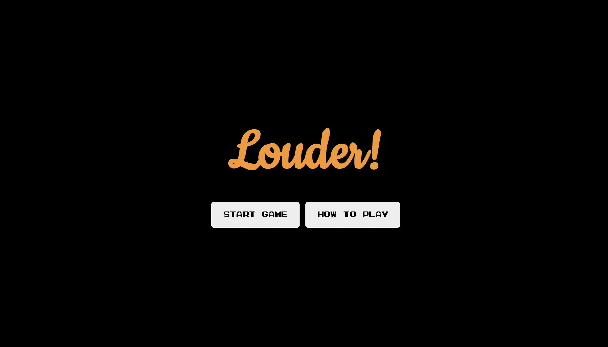
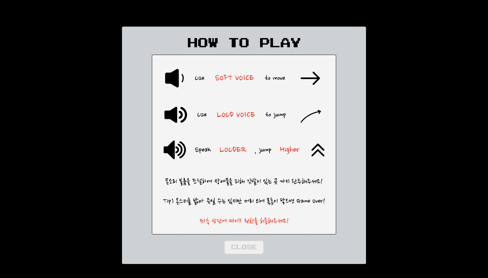
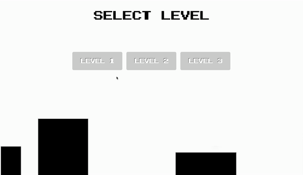

# 🔊 Louder!

## 🎶 What is Louder?

유저의 목소리 데시벨을 이용하여 장애물과 몬스터들을 피해 플랫폼 사이를 이동, 점프하여 깃발이 있는 최종 Finish 지점까지 완주해야하는 음성인식 기반의 웹 게임입니다.
<br>
<br>

## 🎶 Motivation

플래시게임에 대한 추억이 많아 개인 프로젝트로 간단한 게임을 구현하고 싶은 마음이 컸습니다. 이전에 목소리를 이용한 미니 게임을 재밌게 접했던 기억에서 아이디어를 얻어 Web Audio API 를 이용한 음성인식 게임을 기획하게 되었습니다.

### - Why chose Vanilla JavaScript?

초기에는 간단한 앱 게임으로 만들어보고자 React-native의 사용을 고려했었습니다. 하지만, React-native를 이용하여 게임 앱을 개발한다면 native에서 JS로 이벤트를 전송하고 JS에서 native로 UI 업데이트를 전송해야 하는 대기 시간으로 인해 게임에 눈에 띄는 지연이 발생할 수 있다는 것을 알게 되었습니다.

그러다 이전부터 생각해왔던 프레임워크와 라이브러리 없이 Vanilla JavaScript 만을 이용하여 게임을 개발해보면 어떨까? 라는 생각을 기점으로 Vanilla JavaScript 와 canvas 만을 이용하여 프로젝트를 구현하게 되었습니다. 이번 프로젝트를 통해 Vanilla JavaScript의 **OOP, closure, this, 구조 설계**에 대해 많이 고민해볼 수 있었고, 이전에 제대로 정리하지 못했던 자바스크립트의 개념에 대해서도 다시 한번 공부할 수 있었던 시간이었습니다.
<br>
<br>

## 🕹 Game Introduction

#### Start Page



> 게임을 시작하기 전, How to play button을 통해 게임 조작 방법을 알 수 있습니다.

#### How to play



> 목소리의 볼륨 크기를 통해 캐릭터를 조작할 수 있습니다.

- `Soft volume`: 작은 데시벨은 캐릭터를 앞으로 움직일 수 있습니다.
- `Loud volume`: 큰 데시벨은 캐릭터를 점프시킬 수 있습니다.
- `Volume up`: 데시벨이 클수록 캐릭터는 더 높게 점프할 수 있습니다.

> 몬스터는 밟아 죽일 수 있지만, 머리 외에 몸통이 먼저 닿을 시 게임은 종료됩니다.

#### Level select page



> 게임의 난이도를 선택하여 진행할 수 있습니다.

- <b>Level 1 - ice map</b>

  

> 우측 상단에는 Game의 bgm을 끄고 킬 수 있는 On/Off 버튼이 있습니다.

- <b>Level 2 - fire map</b>

  

> 게임의 Finish 지점인 깃발의 남은 위치를 중앙 상단에 있는 % 를 통해 알려 줍니다.

- <b>Level 3 - dark map</b>

  

> Level 에 따라 컨셉/지형/몬스터 종류가 다르며, Level 이 높을 수록 몬스터가 많아지고, 지형이 어려워지는 구조입니다.

<br>

## 🎶 About the difficulties...

---

### `Object Orient Programming (OOP)`

이번 프로젝트에서 캐릭터와 지형을 그려줄 때에 클래스 기반의 객체 지향 언어를 시도해보았는데 canvas와 클래스 문법에 익숙하지 않아 익히는 데에 많은 시간이 걸렸지만, 점차 객체 지향 언어에 대한 이해의 폭을 넓힐 수 있게 되었고, Vanilla JavaScript 만을 사용하면서 프레임워크나 라이브러리들에 대한 장단점과 편리성에 대해서도 몸소 느껴볼 수 있는 시간이었습니다.

처음에는 게임을 구현하면서 익숙한 절차지향 프로그래밍과 함수형 프로그래밍으로 진행하였습니다. 하지만 함수에 많은 매개변수를 전달하고 값을 기억하기 위해 클로저를 만들어야 했습니다. 게임 기능에 의해 함수 간 많은 매개변수 전달 및 코드 간 결합도가 높아지고 방대해짐으로써 유지 보수 및 디버깅이 어려워져 이를 더 개선하기 위해 객체지향 프로그래밍을 도입하게 되었습니다. 객체지향 프로그래밍을 통해 게임 오브젝트의 크기 / 위치 / 이미지 속성을 부여하고 각각의 오브젝트마다 어떠한 행동을 메서드로 정의함으로써 재사용성 향상 및 코드를 더 직관적으로 분리할 수 있었습니다.

<details>
<summary>코드 예시</summary>
<div markdown="1">

```
export default class Particle {
	constructor({ position, velocity, radius }) {
		this.position = {
			x: position.x,
			y: position.y,
		};

    	this.velocity = {
    		x: velocity.x,
    		y: velocity.y,
    	};

    	this.radius = radius;
    	this.timeTheLess = 300;
    }

    draw(ctx) {
    	ctx.beginPath();
    	ctx.arc(this.position.x, this.position.y, this.radius, 0, Math.PI * 2, false);
    	ctx.fillStyle = "red";
    	ctx.fill();
    	ctx.closePath();
    }

    update(ctx, gravity, canvas) {
    	this.timeTheLess--;
    	this.draw(ctx);
    	this.position.x += this.velocity.x;
    	this.position.y += this.velocity.y;

    	if (this.position.y + this.radius + this.velocity.y <= canvas.height) {
    		this.velocity.y += gravity * 0.4;
    	}
    }

}
```

</div>
</details>
<br>

### `canvas`

게임 플레이 화면을 보여주기 위해, Vanila Javascript를 기반으로 HTML에 다양한 애니메이션을 보여줄 수 있는 canvas를 사용하였습니다. 원하는 선/도형/이미지를 그리고, 애니메이션 효과를 넣기 위해 requestAnimationFrame 함수를 재귀로 실행해주었습니다.

게임 특성상 다양한 상황(점프 & 낙하 / 충돌 & 접촉 / 캐릭터 사망 등)에서 canvas에 어떻게 이미지를 그려주어야할지 많은 어려움이 있었습니다. 생동감 있는 게임 캐릭터 구현을 위해 Sprites image를 사용하였기 때문에 기본 60fps로 실행되는 requestAnimationFrame 함수에서 이미지 프레임에 맞게 canvas drawing이 실행되도록 프레임 제어 로직이 필요했습니다.
지면 접촉 및 장애물 충돌 구현을 위해 캐릭터 좌표(x, y)와 지면 및 장애물 좌표를 다양한 경우를 고려하여 로직을 만들어야 했습니다. 이처럼 canvas를 다루는게 까다롭고 어려웠지만, 게임, 웹 디자인 등에 쓰이는 canvas의 활용도에 대해 배울 수 있었던 좋은 경험이었습니다.
<br>
<br>

### `Sprites image`

유저에게 보여지는 즐거움을 극대화하고, 현재 게임이 잘 동작하고 있다는 정보를 전달하기 위해 움직이는 캐릭터와 효과를 주었습니다. canvas 의 frame 기능을 최대한 활용하여 로딩 시간을 단축시켰습니다.
<br>
<br>

### `Web Audio API`

음성인식을 위해 Web Api로 제공되는 <b>Audio Context</b>를 사용하였습니다.
<b>Audio Context의 AnalyserNode</b>를 통해 얻을 수 있는 주파수 데이터가 FFT로 변환되어 제공되는데 이를 원하는 형태로 가공하여 사용하는 것에 어려움이 있어 오픈소스를 개량해서 데시벨의 크기에 따라 캐릭터의 점프 높이를 조절해주었습니다.
<br>
<br>

## 🎶 Schedule

<b>💻 2022. 02. 21 ~ 2022. 03. 13 (3주)</b>

`1주차`

- `기획 단계: 2022년 2월 21일 ~ 2022년 2월 27일`
  - 아이디어 구상 및 검토
  - 기술 스택 검증 및 검토
  - [Mock-up](https://www.notion.so/Mockup-7ed08f7eea9c42029aaedb121663da15) 작업
  - Kanban 생성
  - 사용할 Game sprites 이미지, bgm 정리

`2 & 3주차`

- `개발 단계: 2022년 2월 28일 ~ 2022년 3월 13일`
  - 기능 구현
  - 리팩토링 및 버그 해결
  - 테스트 코드 작성
  - 리드미 작성
    <br>

## 🎶 TechStack

- Vanilla Javascript
- canvas
- HTML
- CSS
- Eslint
- Prettier
- Jest
  <br>

## 🎶 Impression

개발을 진행하면서 중간중간 정확하지 못했던 기술 검증으로 인해 목업과 기획을 많이 바꿔야했던 부분이 있었는데 이를 통해 개발 단계를 거치기 전 정확한 기술 검증과 기획의 중요성에 대해 다시 한번 인지할 수 있었고, 한 개의 프로젝트를 만들기 위해 기획 /디자인 / 개발 등 어느 하나 중요하지 않은 단계가 없다는 것을 몸소 느낄 수 있는 시간이었습니다.

물리 엔진을 사용하지 않고 자바스크립트와 캔버스만으로 캐릭터와 지형의 충돌을 구현하는 부분에 있어서 어려움이 많았지만 개발을 시작하기 이전부터 늘 만들어보고 싶었던 게임을 주제로 작업 할 수 있어 어려움을 뒤로하고 재밌게 구현할 수 있었던 프로젝트였습니다.
